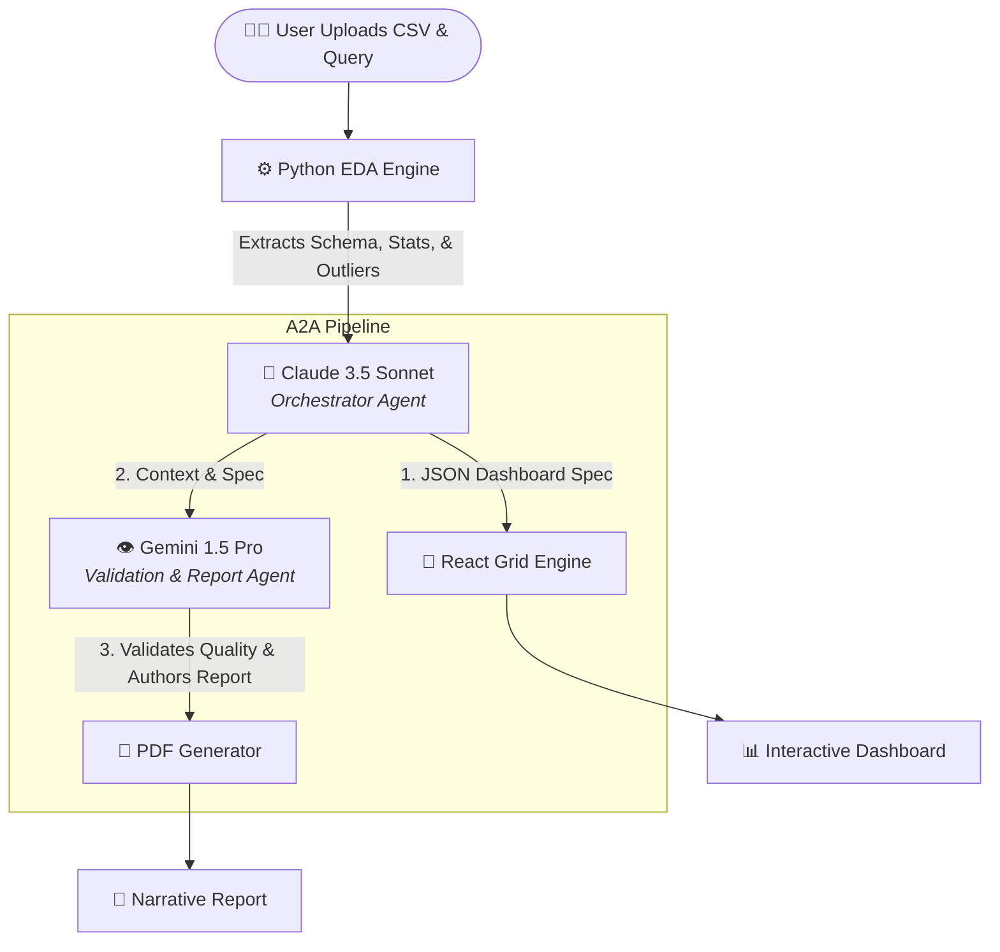

<div align="center">
  <h1>✨ AnalyticsVisualAI</h1>
  <p><strong>A Next-Generation Agent-to-Agent (A2A) Platform for Autonomous Data Visualization & Analysis</strong></p>
  
  [](https://nextjs.org/)
  [](https://fastapi.tiangolo.com/)
  [](https://anthropic.com/)
  [](https://deepmind.google/technologies/gemini/)
  [](https://tailwindcss.com/)
</div>

<br />

## ⚠️ The Problem Statement

In the modern data ecosystem, organizations suffer from the **"Dashboard Bottleneck"**. 
Business stakeholders have questions, but answering them requires data analysts to manually clean data, write SQL, build complex BI dashboards (like Tableau or PowerBI), and write reports. This process takes days or weeks. Furthermore, raw datasets often contain silent data quality issues (nulls, outliers) that go undetected by non-technical users.

## 🎯 Our Solution

**AnalyticsVisualAI** completely eliminates the bottleneck by utilizing an **Agent-to-Agent (A2A) AI Architecture**. 
By simply uploading a raw dataset (CSV) and typing a natural language query, the system autonomously performs Exploratory Data Analysis (EDA), architects a dashboard layout, writes the UI code, and authors a professional narrative report—all in under 15 seconds.

---

## 🤖 Agent-to-Agent (A2A) Architecture

Our platform utilizes a highly specialized A2A pipeline where multiple LLMs collaborate, passing context and tasks to one another asynchronously.



---

## 🧠 Methodology & Workflow

Our methodology is divided into four autonomous phases:

1. **Phase 1: Automated Data Profiling (EDA Engine)**
   The Pandas-based backend engine parses the file in memory. It classifies column types, detects null percentages, calculates cardinality, and identifies anomalies without requiring LLM overhead.
2. **Phase 2: Intent Parsing & Orchestration (Claude)**
   **Claude 3.5 Sonnet** ingests the structural schema and the user's natural language query. It acts as the Orchestrator, deciding which charts (Bar, Scatter, Donut, KPI Cards) best represent the data, and returns a strict JSON specification detailing exact `x_field`, `y_field`, and aggregations.
3. **Phase 3: Dynamic UI Generation**
   The React frontend reads the JSON specification and dynamically mounts Recharts components onto a `react-grid-layout` canvas, allowing the user to seamlessly drag, drop, and resize visual elements.
4. **Phase 4: Validation & Narrative Reporting (Gemini)**
   **Gemini 1.5 Pro** acts as the analytical reviewer. It reads the dataset's sample rows, the EDA schema, and the dashboard configuration to generate a strict, professional Markdown narrative report detailing key findings, data quality scores, and recommendations.

---

## 🚀 Key Features

- **🗣️ Natural Language to Dashboard:** Simply type what you want to see.
- **📊 9+ Dynamic Chart Types:** Supports KPI Cards, Bar, Line, Area, Scatter, Pie, Donut, Funnel, and Data Tables.
- **🎨 Theme Studio:** Switch between stunning UI themes (Ocean, Sunset, Midnight, Cyber) with dynamic CSS variable injection.
- **🛠️ Interactive Grid:** Fully resizable, draggable, and persistent layout canvas.
- **📄 Export & Share:** 
  - Export High-Res PNGs & A4 PDFs.
  - Generate stateless Base64URL **Public Share Links**.
  - Generate AI-written **Gemini Narrative Reports**.

---

## 🛠 Tech Stack

| Domain | Technology | Purpose |
|---|---|---|
| **Frontend** | Next.js 14 (App Router), React, Zustand | UI framework, routing, and state management |
| **Styling** | Tailwind CSS, Framer Motion | Responsive design, dynamic themes, and animations |
| **Visualization** | Recharts, React-Grid-Layout | Composable SVG charts and interactive drag-and-drop grid |
| **Backend** | Python, FastAPI, Pandas | High-performance API routing and mathematical data profiling |
| **AI Agents** | Claude 3.5 Sonnet & Gemini 1.5 Pro | JSON orchestration and narrative reasoning |

---

## 💻 Local Setup Guide

### 1. Clone the repository
```bash
git clone https://github.com/mujtabasaqib19/AnalyticsVisualAI.git
cd AnalyticsVisualAI
```

### 2. Environment Setup
Create a `.env` file in the root directory:
```env
ANTHROPIC_API_KEY=your_claude_api_key
GEMINI_API_KEY=your_gemini_api_key
NEXT_PUBLIC_API_URL=http://localhost:8000
```

### 3. Start the Backend (FastAPI)
```bash
cd backend
python -m venv .venv
# Activate virtual environment
source .venv/Scripts/activate  # Windows
# source .venv/bin/activate    # Mac/Linux
pip install -r requirements.txt
uvicorn main:app --reload --port 8000
```

### 4. Start the Frontend (Next.js)
Open a new terminal window:
```bash
cd frontend
npm install
npm run dev
```

Visit `http://localhost:3000` to start analyzing data!

---

<div align="center">
  <i>Developed for Advanced Agentic AI & Data Analytics implementation.</i>
</div>
